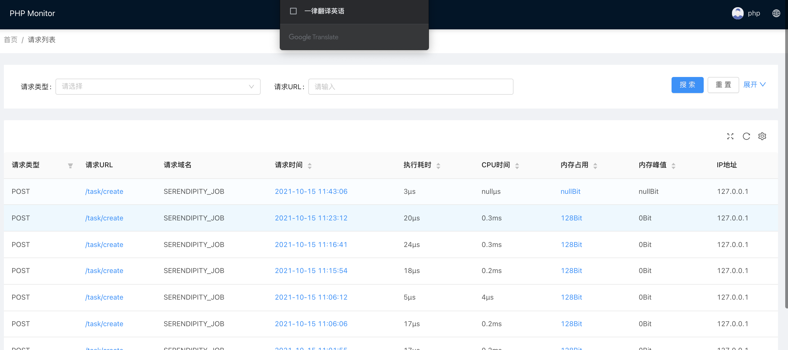
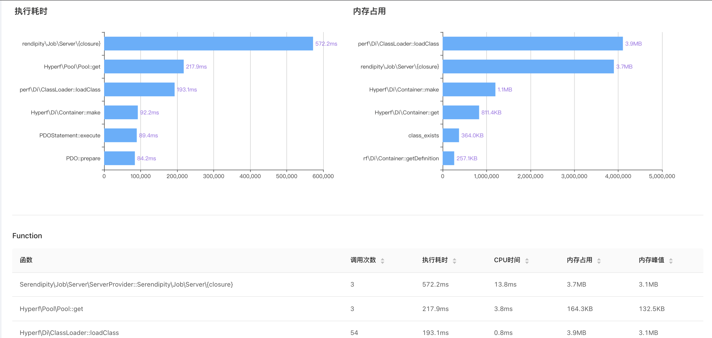
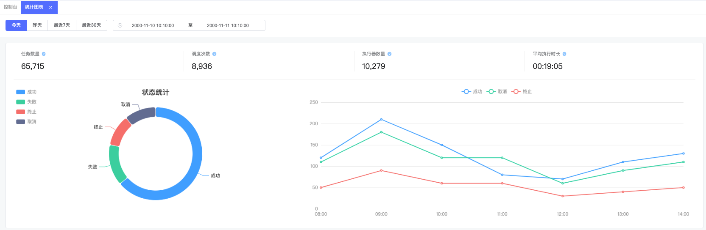

      
<h1 align="center"><i>Serendipity-Job</i></h1>

<div align="center">

🚀 🏆 Task Platform Developed Based On Swow and Php8


[![PHP Version][php-icon]][php-href]
[![Latest Version on Packagist][version-icon]][version-href]
[![Total Downloads][downloads-icon]][downloads-href]
[![License][license-icon]][license-href]

[![Open in Visual Studio Code][vscode-icon]][vscode-href]
[![Star][github-icon]][github-href]

</div>

<p align="center">
<a href="https://github.com/SerendipitySwow/Serendipity-job">
</a>
</p>
<p align="center">
  <a aria-label="License" href="https://github.com/SerendipitySwow/Serendipity-job/blob/main/LICENSE">
    
  </a>
</p>





## 一定要坚持更新下去,等婚礼办理完.

# 🚀Serendipity-Job  For 🏆Swow 分布式任务平台

🚀 🏆 Task Platform Developed Based On Swow and Php8
## 介绍
如今通过PHP开发的任务平台还是停留在原来地同步阻塞模式,通过结合swow开启PHP高性能时代,正式拥抱协程。消息队列选择Nsq利用其易部署,高性能，支持分布式特性。通过Redis分布式锁防止任务并行，实现watchdog防止任务还在执行，而redis锁被释放。给锁续期。该任务平台支持API投递,可以限制其执行时间，支持任务编排,用户可以实时查看任务详情和取消任务,后台支持丰富的图表包括任务统计(成功,失败...)


## 👇 Features👇

```
1.支持Api投递任务.推送Nsq进行消费.(完成)
2.支持任务单个运行，并限制在时间内.超出限制时间抛异常(完成)
3.支持任务编排,单个任务限制时间.(完成)
4.支持任务编排支持事务.(暂不考虑)
5.支持重试机制,中间件(完成)
6.支持API查看任务消息
7.支持后台配置任务.
8.支持定时任务Crontab.(完成,考虑是否取消定时任务)
9.支持任务图表(成功,失败,重试,超时,终止.)(开发中)
10.支持任务取消(完成)
11.签名验证(完成)
12.支持刷新应用签名(完成)
13.支持系统监控基于xhprof(不支持sql)不建议开启
14.workflow->https://github.com/uuf6429/state-engine-php
15.支持分布式(Task可以支持分布式)
16.支持分布式锁(watchdog实现给锁续期)
17.任务执行超时时kill掉，资源回收
```

## 基于Vue、Vditor，所构建的在线 Markdown 编辑器，支持流程图、甘特图、时序图、任务列表、HTML 自动转换为 Markdown 等功能；🎉新增「所见即所得」编辑模式。

[地址](https://github.com/nicejade/markdown-online-editor)

## 👇 Please note👇

```
1.传递的任务Task必须实现JobInterface
2.不能包含资源对象.
3.Swow/channel push 和pop 都是毫秒.任务都可以支持毫秒.以后必须要注意.
4.Di主要使用Hyperf/Di
5.取消任务使用kill
6.crontab随消费进程一起启动
7.限制任务执行时间通过channel 限制pop时间如果pop超时直接对执行任务的协程抛出异常.$coroutine->throw($exception);
[ERROR] Consumer failed to consume Consumer,reason: Channel wait producer failed, reason: Timed out for 5000 ms,file: /Users/heping/Serendipity-Job/src/Util/Waiter.php,line: 53
8.不建议同时启动dag和task两个消费。最好单独部署两个项目,server需要连接对应消费端启动的server查看任务详情或者取消任务.而且定时任务没有做集群处理。多台机器只能执行一个任务.
9.请尽量使用框架自带协程的创建方法,主要用日志上下文管理
 Hyperf\Utils\Coroutine::create()
10.任务执行时间尽量调大一点
11.dag(任务编排)的执行时间必须要小于nsq的max_msg_timeout的时间，因为超过了nsq会重新入队列
```

## 👇 接口文档👇

见API.md

## TODO

* 环境
* 考虑优化项目结构
* codecov代码覆盖率
* 静下来想想思考项目的规划,架构
* 考虑支持分布式(实现中)
* 考虑使用swow-cloud/redis-subscriber订阅消息
* 通过获取服务节点操作任务(分布式),在计划中
* 支持任务图表
* 支持后台创建任务
* 支持ORM
* 压力测试创建任务接口
* 是否考虑给watchdog限制其最大执行时间
* 加入内存分析(samlitowitz/php-memory)
* [FORM](https://github.com/BoBoooooo/Element-Pro-Crud)
* [后台](https://github.com/kanyxmo/MineAdmin)

## Come on!

## Thanks Hyperf.Swow!

## Required

````
1.PHP8
2.Nsq
3.redis
4.mysql
5.ext-swow
6.consul
7.ext-simdjson(https://github.com/crazyxman/simdjson_php)
````

## 👇 Usage👇

[使用说明](usage.md)

## 👇 任务编排👇

[使用说明](dag.md)

## 生产快速启动
1. 启动server
```bash
php bin/blend server:start
````
2. 停止server
```bash
php bin/blend server:stop
```
3. 重新启动
```bash
php bin/blend server:restart
````
## 开发环境启动
1.启动Serendipity-Job Server.

````bash
 php bin/job swow-cloud-job:start
````

2.启动Job 进行任务消费

```bash
php bin/job job:start --host=127.0.0.1 --port=9764
```

#### 参数详解

1.host server host监听地址,用于取消任务或者查卡任务详情

2.port server port监听端口号

3.配置Crontab

```php
 (new SwowCloud\Job\Crontab\Crontab())->setName('Foo')->setRule('*/5 * * * *')->setCallback([EchoCrontab::class, 'execute'])->setMemo('这是一个示例的定时任务'),
```


[php-icon]: https://img.shields.io/badge/php->=8.0-yellow?style=flat&logo=php
[version-icon]: https://img.shields.io/packagist/v/serendipity-swow/serendipity-job.svg?style=flat&logo=packagist
[downloads-icon]: https://img.shields.io/packagist/dt/serendipity-swow/serendipity-job.svg?style=flat&logo=packagist
[license-icon]: https://img.shields.io/badge/license-MIT-red.svg?style=flat&logo=github
[vscode-icon]: https://open.vscode.dev/badges/open-in-vscode.svg
[github-icon]: https://img.shields.io/github/stars/SerendipitySwow/Serendipity-job.svg?style=social&label=Star

[php-href]: https://github.com/MarwanAlsoltany/blend/search?l=php
[version-href]: https://packagist.org/packages/serendipity-swow/serendipity-job
[downloads-href]: https://packagist.org/packages/serendipity-swow/serendipity-job/stats
[license-href]: ./LICENSE
[vscode-href]: https://open.vscode.dev/MarwanAlsoltany/blend
[github-href]: https://GitHub.com/serendipity-swow/serendipity-job/stargazers

### Supporters
[](https://www.jetbrains.com/?from=SerendipitySwow/Serendipity-job)
